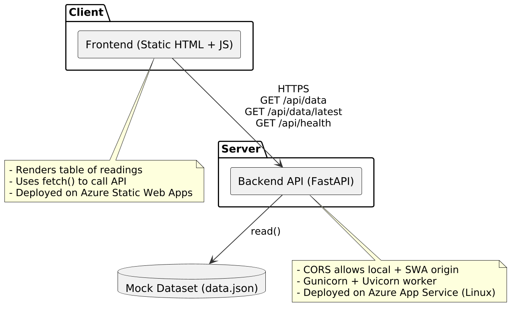
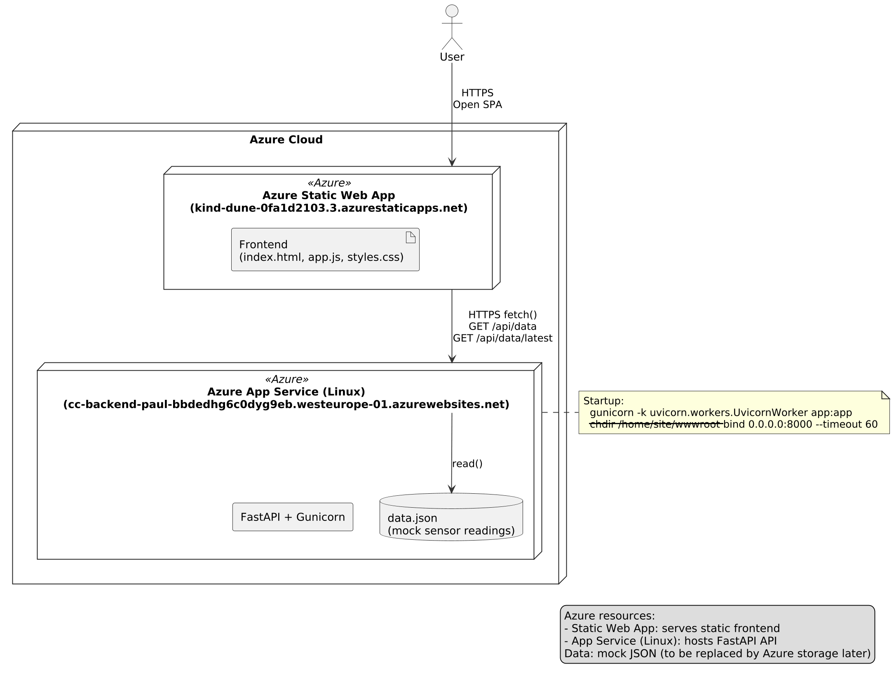

# Cloud Computing – Part 1 Project

This project implements a simple **IoT-style monitoring system** with:
- a **FastAPI** backend serving mock sensor data (temperature, humidity, voltage)
- a **static HTML/JS frontend** fetching and displaying the data in a table

The solution runs locally for development and is also fully deployed on **Microsoft Azure**.

---

## 🔗 Live Deployment

| Component | URL | Hosting Service |
|------------|-----|-----------------|
| **Frontend (Static Web App)** | [https://kind-dune-0fa1d2103.3.azurestaticapps.net](https://kind-dune-0fa1d2103.3.azurestaticapps.net) | Azure Static Web Apps |
| **Backend (API)** | [https://cc-backend-paul-bbdedhg6c0dyg9eb.westeurope-01.azurewebsites.net/api/data](https://cc-backend-paul-bbdedhg6c0dyg9eb.westeurope-01.azurewebsites.net/api/data) | Azure App Service (Linux, Python 3.12) |

---

## 🧩 Architecture Overview

**Frontend:**  
Plain HTML + CSS + JavaScript, no frameworks, fetching API data via `fetch()`.

**Backend:**  
FastAPI app exposing:
- `/api/data` → full mock dataset
- `/api/data/latest` → most recent reading
- `/api/health` → simple status check

**Data:**  
Hardcoded mock sensor readings (local JSON).  
In later phases, this will be replaced by data stored in Azure resources.

---

## ⚙️ Local Development

### 1️⃣ Backend setup

```bash
cd backend
python -m venv .venv
.\.venv\Scripts\activate      # (Windows)
# or source .venv/bin/activate  (Linux/macOS)
pip install -r requirements.txt
uvicorn app:app --reload
```

Test:
curl http://127.0.0.1:8000/api/data

### 2️⃣ Frontend setup

```bash
cd frontend
python -m http.server 8080
```

Frontend runs at http://127.0.0.1:8080
It fetches data from the backend (update API_BASE_URL in frontend/app.js as needed).


☁️ Azure Deployment
Backend (App Service)

Runtime: Python 3.12 (Linux)

Startup Command:

gunicorn -k uvicorn.workers.UvicornWorker app:app --chdir /home/site/wwwroot --bind 0.0.0.0:8000 --timeout 60


Key settings in Configuration → Application settings:

SCM_DO_BUILD_DURING_DEPLOYMENT = true
ENABLE_ORYX_BUILD = true
HTTPS_ONLY = true


Deployment via GitHub Actions
(.github/workflows/backend.yml) using azure/webapps-deploy@v3.

Frontend (Azure Static Web App)

Deployed from /frontend folder via GitHub Actions
(.github/workflows/frontend.yml)

No build step required.


Conceptual architecture:




UML Deployment Diagram:

